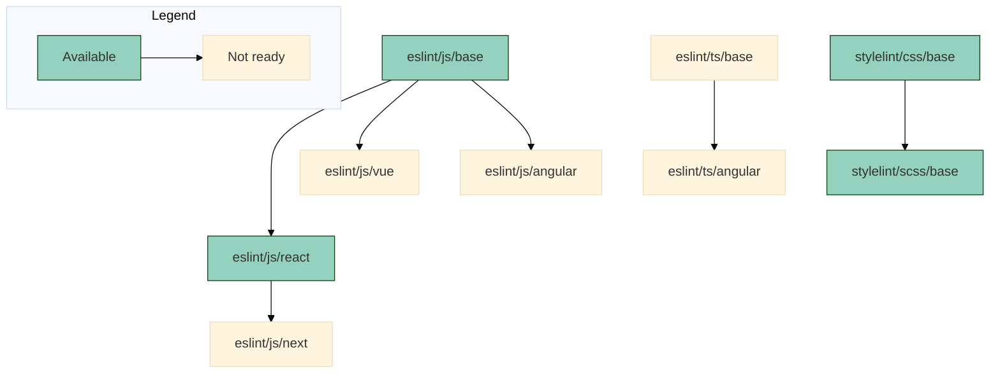

# Code configurations

[![badge][badge]][npm-repo] [![badge-ci][badge-ci]][CircleCI]

Collection of linter configurations and tools to enforce consistent code style
and format according to Maark's recommendations.

The idea is to have a structure of configurations that extend from each other
as needed depending on the project stack, it is important to define rules to be
able to identify anti-patterns and code-smells for specific known libraries.
[This diagram][diagram] helps illustrate the possible configurations:



## Usage

### 1. Install

```bash
npm i --save-dev @maarkllc/code-config
```

### 2. Configure [ESLint]

Create a `.eslintrc.js` file in your project root directory and extend the
configuration depending on the browser stack you are using.

```javascript
module.exports = {
  extends: ['./node_modules/@maarkllc/code-config/configs/eslint/js/base']
}
```

Or it can also be extended this way:

```javascript
const eslintConfig = require('@maarkllc/code-config/configs/eslint/js/base')

module.exports = eslintConfig
```

### 3. Configure [Prettier]

Create a `.prettierrc.js` file in your project root directory.

```javascript
const prettierConfig = require('@maarkllc/code-config/configs/prettier')

module.exports = prettierConfig
```

### 4. Configure [Stylelint]

Create a `.stylelintrc.js` file in your project root directory.

```javascript
module.exports = {
  extends: ['./node_modules/@maarkllc/code-config/configs/stylelint/css/base']
}
```

## Supported configurations by linter

### ESLint

- `eslint/js/base`: It extends from [Airbnb] base configuration.
- `eslint/js/react`: It extends from `eslint/js/base` and Airbnb full
  configuration and hooks rules.

### Stylelint

- `stylelint/css/base`: It extends from `stylelint-config-standard`.
- `stylelint/scss/base`: It extends from `stylelint/css/base` and
  `stylelint-config-standard-scss`.

[badge]: https://img.shields.io/badge/%40maarkllc%2Fcode--config-v1.0.0-blue
[npm-repo]: https://www.npmjs.com/package/@maarkllc/code-config

[badge-ci]: https://circleci.com/gh/MAARK/code-config.svg?style=shield
[CircleCI]: https://app.circleci.com/pipelines/github/MAARK/code-config

[ESLint]: https://eslint.org/
[Prettier]: https://prettier.io/
[Stylelint]: https://stylelint.io/
[Airbnb]: https://github.com/airbnb/javascript

[diagram]: https://mermaid.live/edit#pako:eNp1Uk1vwjAM_StRuIKgE5flgETX3tgu22ktB7d1S7c0qRIXDSH--0IDlI_Nhyh-fn62Ze95rgvkglcG2g37iFLFnNku88AKK1SFB4-2CpLlFmoJmcS1EALODptMFmz1lLxpYgah2K190iXbv8sErawVTb_sNAP7oOFEwiuKU8rphnOS6csNvG33TwBU1UkwPhjeBRX-UKpOfXqUfFvXRLpTeUks7ST2sdz-PcaCDRx7Jt2O4cVyCdZGWLIh25LR3yhGs3AezOJxWUspRs_zKAhjPuYNmgbqwm1sf1RIOW2wwZQL9z0WSXmqDo4HHen3ncq5INPhmHdtAYRRDW6vDRclSOvQFtSn1oPvWXFRkzYXEHv31d9Jfy6HX_JNuoQ
