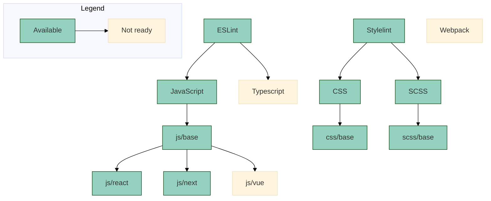

# Code configurations

[![badge][badge]][npm-repo] [![badge-ci][badge-ci]][CircleCI]

[badge]: https://img.shields.io/badge/%40maarkllc%2Fcode--config-v3.0.1-blue
[npm-repo]: https://www.npmjs.com/package/@maarkllc/code-config

[badge-ci]: https://circleci.com/gh/MAARK/code-config.svg?style=shield
[CircleCI]: https://app.circleci.com/pipelines/github/MAARK/code-config

Collection of configurations to enforce consistent development guidelines
using Maark's recommendations.

To install a new configuration you can either use the CLI to handle everything
automatically or do it manually.

## Using the CLI with `npx`

```bash
npx @maarkllc/code-config
```

This will guide you through a few steps that will ultimately install the desired
configuration. That's it, happy coding!

## Installing the CLI globally

Alternatively, you can install the `code-config` CLI globally and use it
like so:

```bash
npm i -g @maarkllc/code-config

code-config
```

### Available commands

If you want to skip the first step you can pass the command as a parameter.
This is optional because if you don't pass anything, the CLI will ask you what
you want to execute.

```bash
code-config [command]
```

* `eslint` To install an ESLint configuration.
* `stylelint` To install a Stylelint configuration.
* `githook` To install a ESLint and Stylelint Git Hook commands.
* `help` Shows the help screen.

e.g.
```bash
code-config eslint

// or

npx @maarkllc/code-config stylelint
```

## Installing configurations manually

All configurations are inside the `configs/` folder, categorized by tool.
Each tool explains how to install it manually.

* [Instructions for ESLint](./configs/eslint/index.md)
* [Instructions for Stylelint](./configs/stylelint/index.md)

## Supported configurations

The idea is to have a structure of configurations that extend from each other
as needed depending on the project stack, it is important to define rules to be
able to identify anti-patterns and code-smells for specific known libraries.
[This diagram][diagram] helps illustrate the possible configurations and how
it can scale in the future to include other tools of trade for bundling or
unit testing:



### ESLint

- `js/base`: It has the basic configuration for JS projects.
- `js/react`: It extends from `js/base` and adds the React plugin and rules which includes hooks.

### Stylelint

- `css/base`: It extends from `stylelint-config-standard`.
- `scss/base`: It extends from `css/base` and
  `stylelint-config-standard-scss`.

### GitHook

Multi select (choose with spacebar one or more) between:
- `eslint`: to add hook to validate eslint.
- `stylelint`: to add hook to validate Stylelint.

## Development

For more information please refer to the [documentation].

[documentation]: ./docs/index.md

[ESLint]: https://eslint.org/
[Prettier]: https://prettier.io/
[Stylelint]: https://stylelint.io/
[GitHooks]: https://git-scm.com/book/en/v2/Customizing-Git-Git-Hooks

[diagram]: https://mermaid.live/edit#pako:eNp9Ul1rwjAU_SslUvrimA5floeBtVUZ3V4qDJb6ENurZqZpaVJZKf3vSxNUht3ylHs-ck_gtCgtMkAYuW7LBFPYaT11hBw87O2oBK_rXDcRh4qWR2cTJMLRR9Y7C0RwAJFZsD_RlMzPlHG647DFGNPL4Dw8vDjRE3kvlFMBzZqtNRm3vc5JGEdMqHufT141EKcVK3-z1ugb0YJ8ycc-8YBiYRRBr9DLU_WnRAsEfKt_6HMN18AGC8mmKUHacBdqSWLVcOCD31mRRRwPRFgadk3iYXpl6FTaX97za8PLYYGVfMCupOnpMqacShnA3rnlk6oqToBHE382nYTjPeMcj55nwdQP0RjlUOWUZbotbf9CgkxTEoT1td-ZoER0WkdrVcSNSBFWVQ1jVJcZVRAwqluTI7ynXGq0pOKzKG5zVdSH43WynjBjqqiuIJjxzTbWFLf7ARMf4SQ
