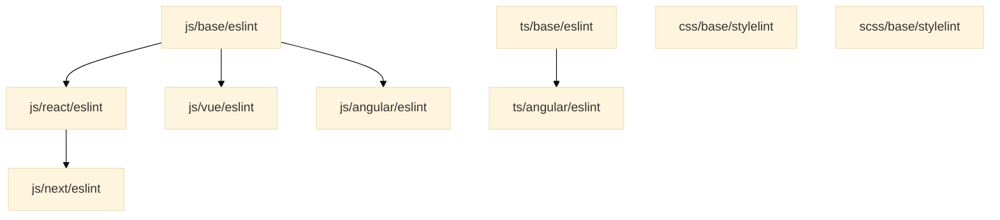

# Code configurations

[![badge][badge]][npm-repo] [![badge-ci][badge-ci]][CircleCI]

Collection of linter configurations and tools for enforcing consistent coding
style and format according to Maark's recommendations.

## Usage

### 1. Install

```bash
npm i --save-dev @maarkllc/code-config
```

### 2. Configure ESLint

Create a `.eslintrc.js` file in your project root directory and extend the
configuration depending on the browser stack you are using.

```javascript
module.exports = {
  extends: ['./node_modules/@maarkllc/code-config/js/base/eslint']
}
```

Or it can also be extended this way:

```javascript
const eslintConfig = require('@maarkllc/code-config/js/base/eslint')

module.exports = eslintConfig
```

### 3. Configure Prettier

Create a `.prettierrc.js` file in your project root directory.

```javascript
const prettierConfig = require('@maarkllc/code-config/js/base/prettier')

module.exports = prettierConfig
```

### 4. Configure Stylelint

Create a `.stylelintrc.js` file in your project root directory.

```javascript
module.exports = {
  extends: ['./node_modules/@maarkllc/code-config/css/base/stylelint']
}
```

## Specific configurations

The idea is to create a structure of configurations that extend from each other
as needed depending on the project stack, it is important to define rules to be
able to identify anti-patterns and code-smells for specific known libraries.
[This diagram][diagram] helps illustrate the possible configurations, but it
doesn't represent the current availability:



### Currently supported

#### JavaScript

- `js/base/eslint`: base JavaScript [ESLint] rules. It extends from [Airbnb],
  and it uses [Prettier] to format the code.
- `js/react/eslint`: JavaScript rules for React. It extends from
  `js/base/eslint`.

#### CSS

- `css/base/stylelint`: base CSS [Stylelint] rules.

[badge]: https://img.shields.io/badge/%40maarkllc%2Fcode--config-v1.0.0-blue
[badge-ci]: https://circleci.com/gh/MAARK/code-config/tree/v1.0.0.svg?style=shield

[npm-repo]: https://www.npmjs.com/package/@maarkllc/code-config
[CircleCI]: https://app.circleci.com/pipelines/github/MAARK/code-config

[ESLint]: https://eslint.org/
[Prettier]: https://prettier.io/
[Airbnb]: https://github.com/airbnb/javascript

[diagram]: https://mermaid.live/edit#pako:eNptkMEOgjAMhl9l6RnCfQcTCT6B3pyHyipg2DBbZySEd3cQiEHdqfm_r2vaAcpOE0ioHD5qcSqUFfHtz3efXdFTRr5tLF9Emu5EPqWOsOQ1XuyZRvYMa8MXQFuFFt0G5iu09OIN4c3sWeP_f5R-UT33LX1y_wsgAUPOYKPjtsOkKeCaDCmQsZxkBcqO0QsPjUwH3XDnQN6w9ZQABu6OvS1Bsgu0SkWD8XJmscY3Oalvgw
