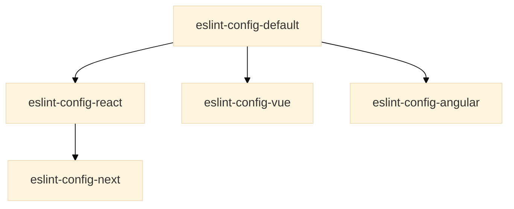

# Default ESLint configuration

[![badge][badge]][npm-repo]

Maark's recommended base [ESLint] configuration projects. It extends from
[Airbnb] base configuration and uses [Prettier] to format the code.

## Usage

### Install

```bash
npm i --save-dev @maarkllc/eslint-config-default
```

### Configure ESLint

Create a `.eslintrc.js` file in your project root directory.

```javascript
module.exports = {
  extends: ['@maarkllc/eslint-config-default']
}
```

### Configure Prettier

Create a `.prettierrc.js` file in your project root directory.

```javascript
const prettierConfig = require('@maarkllc/eslint-config-default/.prettierrc.js')

module.exports = prettierConfig
```

## More specific configurations

The intent here was to build the most basic set of rules for any JavaScript
project but not all projects use the same stack, and it is also important to
define rules to be able to identify anti-patterns and code-smells for specific
known libraries.

The idea is to create a structure of configurations that extend from each
other. Something like [this diagram][diagram]:



[badge]: https://img.shields.io/badge/%40maarkllc%2Feslint--config--default-1.0.0-blue
[npm-repo]: https://www.npmjs.com/package/@maarkllc/eslint-config-default
[ESLint]: https://eslint.org/
[Prettier]: https://prettier.io/
[Airbnb]: https://github.com/airbnb/javascript

[diagram]: https://mermaid.live/edit#pako:eNp1j00OgjAQRq_SzJpegIWJBE-gO8tipAM06Q8pU6Mh3N2iuNDorL7Me5PMN0MbNEEJfcRxEKdaeZFnf6bJGs-yDb4zvdTUYbLcCCl3ovqCkbDlZjt8Gp_8mug_RN8ni_ElVD8ETzdeKRTgKDo0On87rxsFPJAjBWWOF5xyUn7JXho1Mh204RCh7NBOVAAmDse7b6HkmOgt1QZzc7dZywMW5VoW
