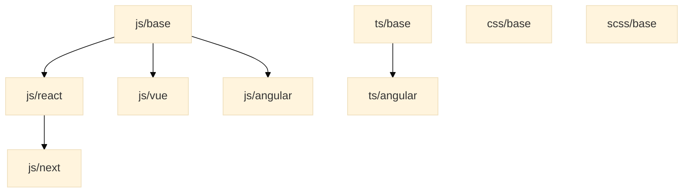

# Coding standards

[![badge][badge]][npm-repo]

Collections of linter configurations and tools for enforcing consistent coding
style and format according to Maark's coding standards.

## Usage

### 1. Install

```bash
npm i --save-dev @maarkllc/coding-standards
```

### 2. Configure ESLint

Create a `.eslintrc.js` file in your project root directory and extend the
configuration depending on the browser stack you are using.

```javascript
module.exports = {
  extends: ['@maarkllc/coding-standards/js/base/eslint']
}
```

### 3. Configure Prettier

Create a `.prettierrc.js` file in your project root directory.

```javascript
const prettierConfig = require('@maarkllc/coding-standards/js/base/prettier')

module.exports = prettierConfig
```

### 4. Configure Stylelint

Create a `.stylelintrc.js` file in your project root directory.

```javascript
module.exports = {
  extends: ['@maarkllc/coding-standards/css/base/stylelint']
}
```

## Specific configurations

The idea is to create a structure of configurations that extend from each other
as needed depending on the project stack, it is important to define rules to be
able to identify anti-patterns and code-smells for specific known libraries.
[This diagram][diagram] helps illustrate the possible configurations but it
doesn't represent the current state:



### Currently supported

#### JavaScript

- `js/base`: base JavaScript [ESLint] rules. It extends from [Airbnb], and it
  uses [Prettier] to format the code.
- `js/react`: JavaScript rules for React. It extends from `js/base`.

#### CSS

- `css/base`: base CSS [Stylelint] rules.

[badge]: https://img.shields.io/badge/%40maarkllc%2Fcoding--standards-1.0.0-blue
[npm-repo]: https://www.npmjs.com/package/@maarkllc/coding-standards
[ESLint]: https://eslint.org/
[Prettier]: https://prettier.io/
[Airbnb]: https://github.com/airbnb/javascript

[diagram]: https://mermaid.live/edit#pako:eNpdjzEOgzAMRa8SeQZ1z1CpiJ6g3QqDm7hARQJKnKoV4u4NBBY8-b__bdkTqEETSGgcjq24l5UVsS6Ptz890VMt8vwsikU6QsX15q84wk-gA0HbhB5dosVOLX05IU6LV4MPceWTmZTfJWRgyBnsdDx0WswKuCVDFcjYrhNQ2TnmwqiR6ao7HhzIF_aeMsDAw-1nFUh2gfZQ2WF82myp-Q_5slQj
